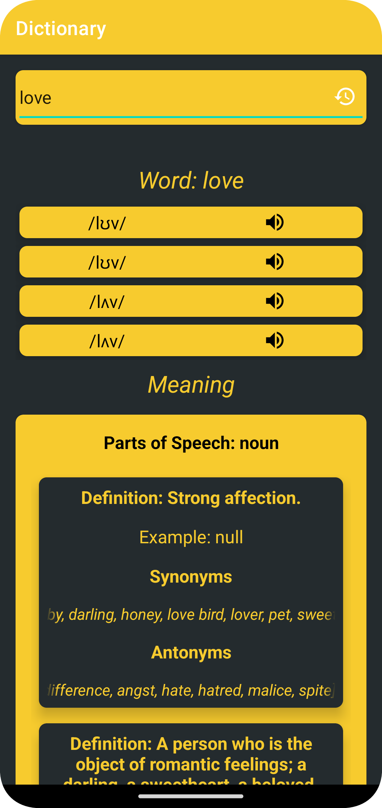
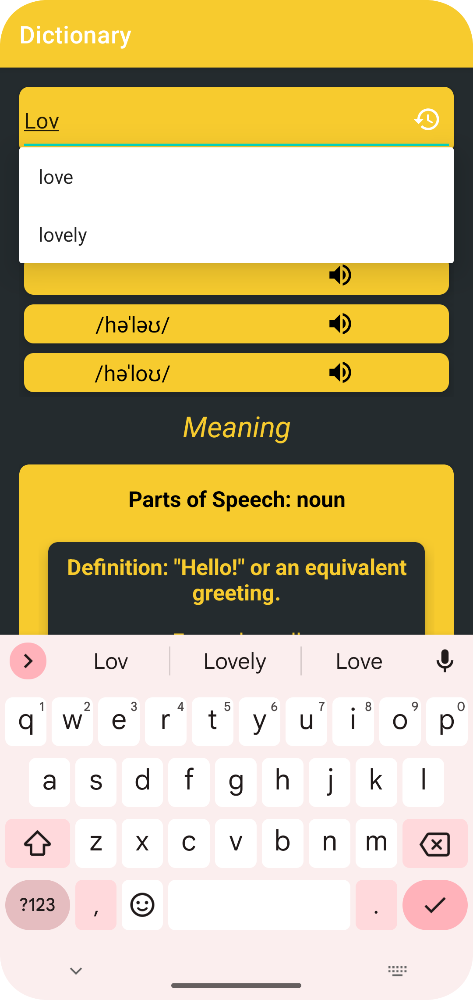
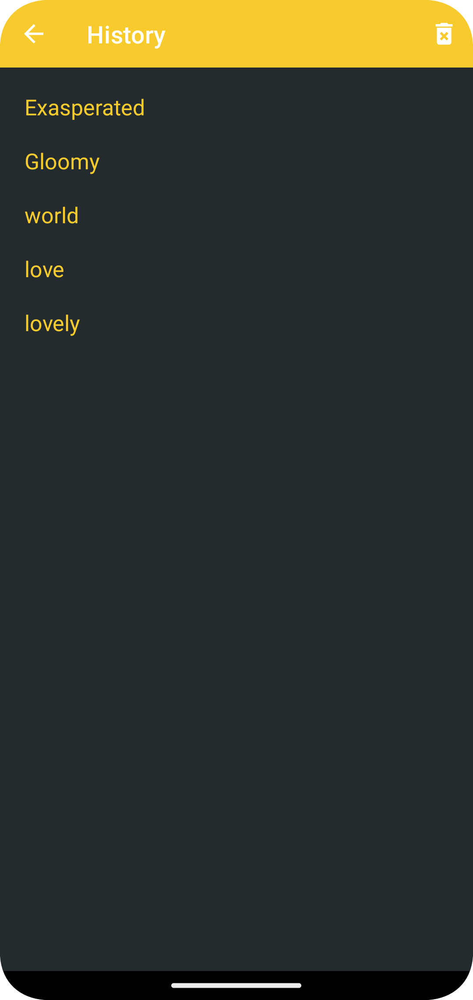

# TheDictionary 📚

Welcome to The Dictionary , your go-to Android app for exploring the English language! 📖

   

## Features

- **Online Dictionary:** Utilizes the [DictionaryAPI](https://api.dictionaryapi.dev/api/v2/) with Retrofit library for real-time data on English words.

- **Meaningful Information:** Provides detailed meanings, definitions, synonyms, antonyms, and multiple examples for searched words.

- **Search History:** Implements Room Database to store and display a history of searched words, allowing users to access their search records anytime.

- **History Management:** Enables users to delete specific words or clear the entire search history.

## Technologies Used

- **Java Programming Language:** Developed using Java for robust and efficient functionality.

- **Retrofit Library:** Utilized Retrofit for seamless data fetching from the DictionaryAPI.

- **Room Database:** Employed Room Database to store and manage the history of searched words.

              

## Getting Started

To get started with Dictionary Explorer:

1. Clone this repository to your local machine.
2. Open the project in Android Studio.
3. Run the app on an emulator or a physical device.

## Usage

- Search for English words to get detailed information.
- Explore meanings, definitions, synonyms, antonyms, and examples.
- Access and manage your search history within the app.

## Contributing

Contributions are welcome! If you'd like to contribute, please follow these steps:

1. Fork this repository.
2. Create a new branch for your feature or bug fix.
3. Commit your changes and submit a pull request.

Explore the richness of the English language with TheDictionary ! 🌐📝

#Dictionary #AndroidApp #Java #Retrofit #RoomDatabase
